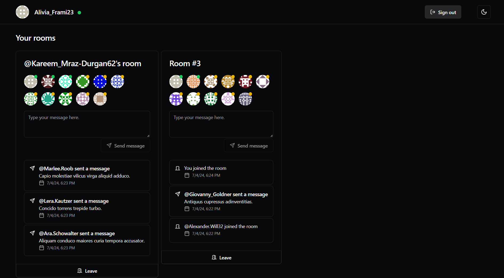

# SurrealDB Presence Demo

This is a demo project on how to create a realtime presence web application using SurrealDB Live Queries.



## Tech stack

This is a list of the most important technologies used in this project:

- React + TypeScript (Vite template)
- TanStack Query
- jotai (jotai-forms)
- SurrealDB
- surrealdb-migrations

## Features

- Authentication
  - Sign up
  - Sign in
  - Sign out
  - Display authenticated user details such as realtime presence
- List of rooms with number of active users
  - List of joined rooms vs. other rooms
  - Join a room
- Joined rooms
  - Display the list of users in rooms
  - Show presence of each user
  - Send message
  - Show realtime messages (when a user entered or left a room, when a new message is sent)
  - Leave the room

Current configuration:

- Signal user presence in room periodically (every 10 seconds)
- Display presence status:
  - **green** - < 2min of inactivity
  - **yellow** - < 10min of inactivity
  - **gray** - > 10min of inactivity

## Get started

1. Start a new SurrealDB instance locally

```bash
surreal start --log debug --user root --pass root memory --auth --allow-guests
```

2. Apply migrations

```bash
surrealdb-migrations apply
```

3. Install dependencies and run the web app

```bash
bun install
bun start
```

4. Launch your web browser on the generated url (eg. http://localhost:5173/) and play with the app (create new accounts, join rooms, leave rooms)

And voilà!

## Architecture

This project is using the following architecture:

- `/schemas` - list of SurrealDB tables
- `/events` - list of SurrealDB events
- `/migrations` - list of db migrations that will be automatically applied
- `/src`
  - `/api` - TanStack query hooks
  - `/components`
  - `/constants`
  - `/contexts` - Theme and SurrealDB providers
  - `/hooks` - custom React hooks
  - `/lib` - functions and app models
  - `/mutations` - surql query files to create or update data, using SurrealDB events
  - `/pages`
  - `/queries` - surql query files to query the database, using SurrealDB tables
